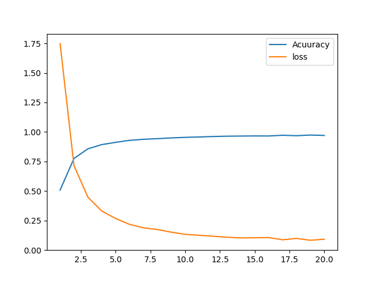
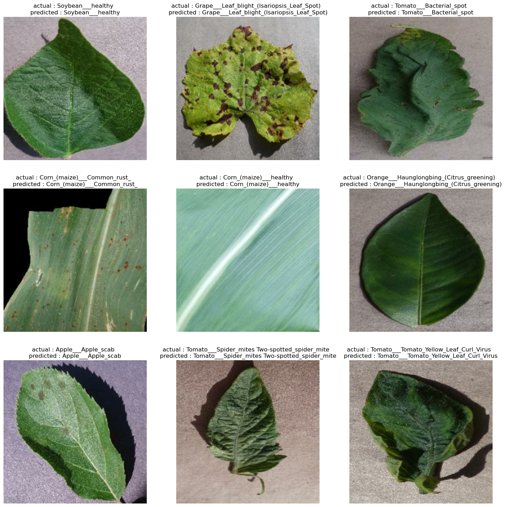
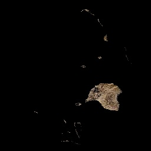

# Plant Disease Detection with Convolutional Neural Networks (CNN) 

## Overview
Plant diseases can significantly impact crop yield and quality. Timely detection is crucial for effective agricultural management. This project employs Convolutional Neural Networks (CNNs) to create a robust plant disease detection system.

## Introduction
Plant diseases pose a significant threat to global food security. In this project, we leverage the power of Convolutional Neural Networks (CNNs) to develop a robust plant disease detection system. The dataset consists of images collected from various plant species, each labeled with the corresponding disease. By training a CNN on this dataset, we aim to achieve a model that can accurately identify and classify plant diseases, enabling farmers to take proactive measures in response to potential threats.

## Table of Contents
1. [Dataset Loading and Preprocessing](#1-dataset-loading-and-preprocessing)
2. [Model Architecture](#2-model-architecture)
3. [Model Training](#3-model-training)
4. [Model Evaluation](#4-model-evaluation)
5. [Prediction and Evaluation](#5-prediction-and-evaluation)
6. [Results Visualization](#6-results-visualization)
7. [Confusion Matrix Heatmap](#7-confusion-matrix-heatmap)
8. [Results](#8-results)
9. [Requirements](#9-requirements)
10. [Extras](#10-Extras)
11. [Usage](#11-usage)
12. [Contributing](#12-contributing)

## 1. Dataset Loading and Preprocessing
Data preprocessing is a crucial step in preparing the dataset for model training. The dataset is loaded using TensorFlow's `image_dataset_from_directory` function. Images are resized to (224, 224) pixels and split into training and testing subsets.

## 2. Model Architecture
The CNN model architecture plays a vital role in learning intricate patterns. This project utilizes a CNN architecture designed for effective plant disease classification.

## 3. Model Training
The model is trained on the prepared dataset, and training progress is visualized using accuracy and loss plots.

## 4. Model Evaluation
The trained model is evaluated on the test dataset, and metrics such as accuracy and loss are assessed.

## 5. Prediction and Evaluation
The model predicts classes on the test dataset, and the actual labels are extracted for comparison.

## 6. Results Visualization
The results are visualized, showcasing predicted and actual labels for test images.

## 7. Confusion Matrix Heatmap
A heatmap of the confusion matrix provides a visual summary of the model's classification performance. It is also implemented in the project.

## 8. Results
The project achieves an accuracy of 97%, demonstrating the effectiveness of the CNN model in plant disease detection.

## 9. Requirements
- Python
- TensorFlow
- NumPy
- Matplotlib
- OpenCV
- Scikit-learn
- Seaborn

## 11. Extras
In addition to the CNN-based approach for plant disease detection, this project includes a manual implementation of interest point extraction and disease extraction using the Scale-Invariant Feature Transform (SIFT).

### Manual Interest Point and Disease Extraction:
While the CNN model automatically extracts features during training, the manual approach involves the following steps:
   - Load an image of a plant leaf.
   - Convert the image to HSV color space and grayscale for SIFT.
   - Define the color range for disease.
   - Initialize the SIFT detector.
   - Detect interest points and compute descriptors using SIFT.
   - Draw interest points on the original image.
   - Create a mask based on the color range for disease.
   - Extract diseased regions using bitwise AND operation.
   - Display the original image, diseased regions, and interest points.
   - Save the result image.

This manual approach allows for experimentation with different images and color ranges for disease, providing flexibility in adapting the code to specific use cases.

## 11. Usage
1. Download the dataset from [Kaggle](https://www.kaggle.com/datasets/abdallahalidev/plantvillage-dataset/code).
2. Store the dataset in the './dataset/' directory.
3. Set up the Python environment with required packages.
4. Execute the provided Jupyter Notebook or Python script.

## 12. Contributing
Contributions are welcome! Feel free to open issues and pull requests.

